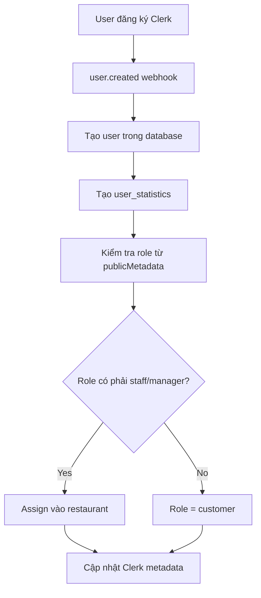
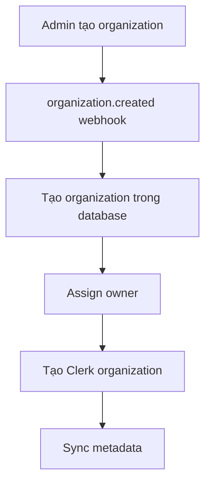
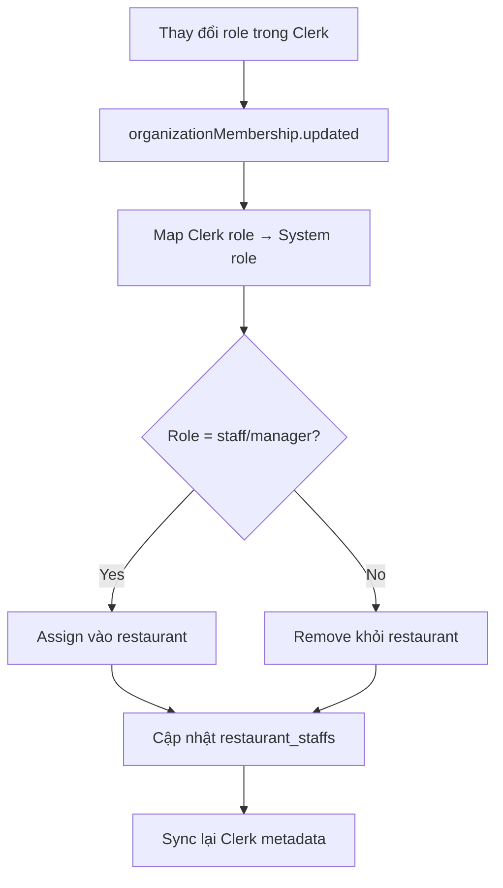

# 🚀 HỆ THỐNG WEBHOOK CLERK NÂNG CAO

## ✅ TÍNH NĂNG HIỆN TẠI

### 🔗 Webhook Endpoints
- **Basic webhook**: `/api/clerk/webhooks` (legacy support)
- **Advanced webhook**: `/api/clerk/webhooks/advanced` (khuyên dùng)
- **Test webhook**: `/api/clerk/webhooks/test`

### 📡 Events Được Hỗ Trợ

#### 👤 User Events (Cơ bản)
- `user.created` - Tạo user mới từ Clerk
- `user.updated` - Cập nhật thông tin user
- `user.deleted` - Xóa/vô hiệu hóa user

#### 🏢 Organization Events (Multi-Organization)
- `organization.created` - Tạo organization mới
- `organization.updated` - Cập nhật thông tin organization
- `organization.deleted` - Xóa organization

#### 👥 Organization Membership (Role Management)
- `organizationMembership.created` - Thêm thành viên vào organization
- `organizationMembership.updated` - Thay đổi role thành viên
- `organizationMembership.deleted` - Xóa thành viên khỏi organization

#### 🔐 Session Events (Security Tracking)
- `session.created` - User đăng nhập
- `session.ended` - User đăng xuất
- `session.removed` - Session bị xóa
- `session.revoked` - Session bị thu hồi (security)

#### 📧 Contact Events (Optional)
- `email.created` - Thêm email mới
- `phoneNumber.created` - Thêm số điện thoại mới

## 🎯 WORKFLOW HỆ THỐNG

### 🆕 Tạo User Mới


### 🏢 Tạo Organization


### 👥 Role Management


## 🏆 LỢI ÍCH WEBHOOK NÂNG CAO

### ✅ 1. Multi-Organization Support
- **Automatic Organization Creation**: Tự động tạo organization khi có `organization.created`
- **Owner Assignment**: Tự động assign owner từ Clerk
- **Organization Hierarchy**: Hỗ trợ cấu trúc organization → restaurant_chains → restaurants

### ✅ 2. Advanced Role Management
- **Dynamic Role Assignment**: Tự động assign role dựa trên organization membership
- **Restaurant Staff Management**: Tự động assign staff vào restaurant khi có role phù hợp
- **Role Change Sync**: Đồng bộ ngay lập tức khi role thay đổi
- **Multi-Restaurant Support**: User có thể làm việc tại nhiều restaurant

### ✅ 3. Enhanced Security
- **Session Tracking**: Monitor user login/logout activities
- **Security Event Handling**: Xử lý session revoked, suspicious activities
- **Access Control**: Real-time role-based access control
- **Audit Trail**: Log tất cả role changes và access attempts

### ✅ 4. Data Consistency
- **Real-time Sync**: Thông tin user được sync ngay lập tức
- **Automatic Cleanup**: Tự động cleanup khi user bị xóa
- **Metadata Sync**: Đồng bộ metadata giữa Clerk và database
- **Error Handling**: Robust error handling với retry logic

### ✅ 5. Restaurant Chain Management
- **Multi-Restaurant Staff**: Staff có thể được assign vào nhiều restaurant
- **Manager Automation**: Tự động assign manager role khi có restaurant management
- **Organization Hierarchy**: Hỗ trợ cấu trúc phức tạp organization → chains → restaurants
- **Access Control**: Fine-grained access control cho từng level

## 🔧 CÁCH SETUP

### 1. Environment Variables
```env
CLERK_WEBHOOK_SECRET=whsec_your_webhook_secret_here
```

### 2. Clerk Dashboard Configuration
1. Đi tới **Clerk Dashboard > Webhooks**
2. Tạo endpoint mới: `https://yourdomain.com/api/clerk/webhooks/advanced`
3. Chọn các events:
   - All User events
   - All Organization events
   - All Organization Membership events
   - All Session events (optional)
   - Email/Phone events (optional)
4. Copy webhook secret và thêm vào `.env`

### 3. Test Webhook
```bash
curl -X POST https://yourdomain.com/api/clerk/webhooks/test \
  -H "Content-Type: application/json" \
  -d '{"test": true}'
```

## 📊 WORKFLOW CỤ THỂ CHO ỨNG DỤNG CỦA BẠN

### 🏢 Scenario: Tạo Restaurant Chain
1. **Organization Owner** tạo organization trong Clerk
2. Webhook `organization.created` → Tạo organization trong database
3. Owner được assign role `admin` tự động
4. Tạo restaurant chain thuộc organization
5. Assign manager cho chain (role `manager`)
6. Webhook `organizationMembership.created` → Assign manager vào chain

### 👨‍💼 Scenario: Assign Staff
1. **Manager** invite staff vào organization
2. Webhook `organizationMembership.created` → User được assign role `staff`
3. Manager assign staff vào specific restaurant
4. Webhook `organizationMembership.updated` → Update metadata với restaurant_id
5. Staff có access vào restaurant system

### 🔄 Scenario: Role Change
1. **Admin** thay đổi role từ `staff` → `manager`
2. Webhook `organizationMembership.updated` 
3. Remove khỏi staff assignments cũ
4. Assign vào manager role cho restaurant
5. Update access permissions
6. Sync metadata với Clerk

## 🚨 SECURITY CONSIDERATIONS

### ✅ Webhook Security
- **Svix Verification**: Tất cả webhook đều được verify với Svix
- **HTTPS Required**: Chỉ accept HTTPS requests
- **Rate Limiting**: Built-in rate limiting cho webhook endpoints
- **Error Handling**: Comprehensive error handling và logging

### ✅ Access Control
- **Role-based Access**: Multi-level role-based access control
- **Organization Isolation**: Users chỉ access được organization của mình
- **Restaurant-level Access**: Fine-grained access cho từng restaurant
- **Manager Permissions**: Manager chỉ manage được restaurant được assign

### ✅ Data Protection
- **Soft Delete**: User deletion sử dụng soft delete để preserve data
- **Audit Logging**: Log tất cả changes cho compliance
- **Data Sync**: Consistent data sync giữa Clerk và database
- **Backup Strategy**: Webhook events có thể replay để recover data

## 🔮 TƯƠNG LAI EXPANSION

### 🎯 Planned Features
- **Advanced Analytics**: Track user engagement, session duration
- **Multi-tenant Support**: Support cho multiple brands/tenants
- **Advanced Notifications**: Real-time notifications cho role changes
- **Integration Events**: Webhook cho external service integrations
- **Automated Onboarding**: Auto-assign training materials cho new staff

### 🚀 Scalability
- **Event Queue**: Background job processing cho heavy operations
- **Webhook Retry**: Automatic retry với exponential backoff
- **Performance Monitoring**: Monitor webhook performance và response times
- **Load Balancing**: Support cho high-volume webhook traffic

---

**🎉 KẾT LUẬN**: Hệ thống webhook nâng cao này cung cấp foundation mạnh mẽ cho multi-organization restaurant management system với comprehensive role management, security, và scalability.
